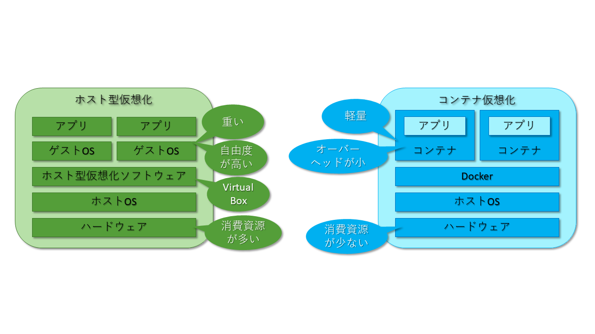
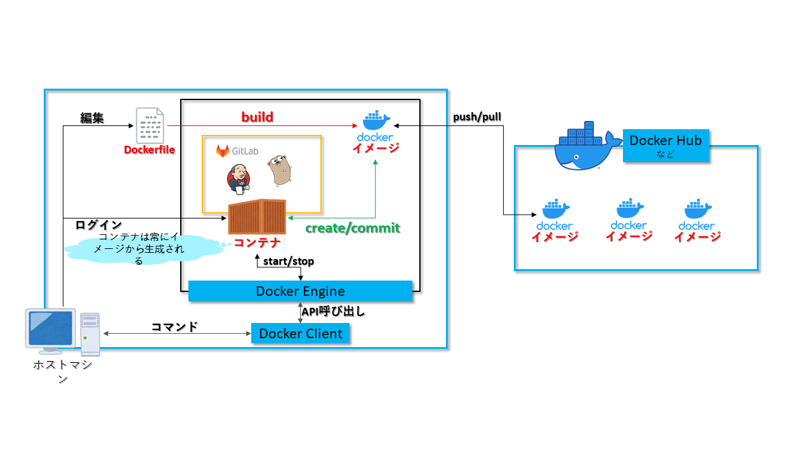
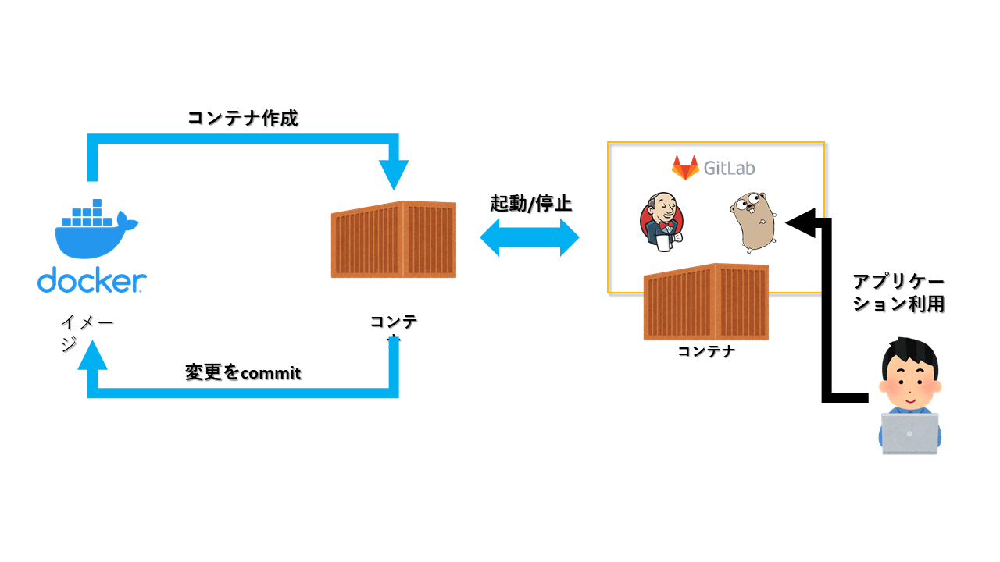

# Docker入門

## Dockerとは

Dockerは``コンテナ``を利用した仮想環境作成構築プラットフォームの一つで、ホストOS上で様々なOSや環境のコンテナを簡単に起動できるようになるのが特徴である。

Dockerのようなコンテナとよく比較されるのが``VirtualBox``などの仮想マシンであるが、以下の図に示すように、仮想マシンではホストOS上にVirtualBoxなどの``HyperVisor``が動作している。  
このHyperVisorは仮想的なマシンを構築し、ゲストOSはその仮想的なマシン上で動く。  
対してDockerではコンテナ内のアプリケーションが``Docker Engine``を経由して**共通のホストOS(カーネル)**で稼働する為、非常に軽量でオーバーヘッドを小さく動作することができる。  

ホストOSからは各コンテナがプロセスの一つとして稼働しており、そのコンテナはそれぞれ分離された空間が提供されている。  



### Dockerのメリット

Dockerを利用する最大のメリットが環境構築や改変が非常に容易に短時間に行えることと、後述するイメージやDockerfileを利用することで同一の環境を簡単に配布できることにある。  
以上のことからマイクロサービスやスケーラブルなシステムに対して大きなメリットとなる。

### デメリット

Dockerはコンテナの稼働にホストOSを利用することから、コンテナ上で稼働させるカーネル以外のホストOS上では動作させることができない。  
上記の理由から、以前はWindows上ではDockerが上手く動作しなかったが、現在はWSL2の登場によりLinuxカーネルを動かすことができるようになったため、Windowsでも非常に簡単にDockerの恩恵を受ける事ができるようになった。  

また、コンテナは揮発性であることにも注意が必要である。  
コンテナ内に入り、ファイルの作成やアプリケーションのインストール、起動などを行うことはできるが、イメージに保存したりしない限り、コンテナを削除するとそのデータは全て消滅する。  
アプリケーションログなども同じである為、必要なデータは外部に保存するような仕組みが必要になる。

### Dockerの概要図



#### イメージとコンテナの関係

Dockerにおいて、実際にアプリケーションが動作するのが``コンテナ``であるが、そのコンテナは``イメージ``から作られる。  
イメージはいわゆるひな型のようなもので、同一のイメージからは同一のコンテナが複数生成でき、またイメージに手を加えることで新しいイメージを作成することができる。  
コンテナは作成後、起動することで有効になり、そのなかでアプリケーションを動作させることができる。



イメージの実態は様々な情報やバイナリなどが定義されたレイヤ構造になっており、後述するDockerfileなどで制御することができる。ただし、利用する側からはそのレイヤが全て一体となって動作する。  

イメージはローカルを含め様々な``レジストリ``に保存することができ、``Docker Hub``などのレジストリに公開することで全世界で共通のイメージを利用することができる。  
また個別にレジストリサーバやサービスを利用することで、特定の範囲内でイメージを利用することもできる。  

イメージからコンテナを起動すると、コンテナの中ではそのイメージの定義に従って何らかのアプリケーションが稼働する。  
一度作成したコンテナは止めたり再起動することもできる。  
コンテナの内部に接続し、操作や変更を行うこともできる。  
ただし、一点注意しなくてはいけないこととして、基本的にコンテナ内部の操作や変更は**コンテナを削除した場合すべて失われる。**  
例えば何らかのアプリケーションが稼働しており、そのログを収集する必要がある場合、コンテナ内部にログを出している場合は、何らかの要因によってコンテナが消えた場合はログも消えてしまう。  
それら変更や操作を保存する為にボリュームをマウントしたりするが、その方法については別の章で解説する。

## Docker環境の構築

この節から実際にDockerを操作してみる。  
今回はWindows上でDockerが利用できるようにするため、``Docker Desktop for Windows``のインストール及び各種環境の設定を行う。

### 事前準備

前述したように、以前のWindowsでは様々な制約からWindows10 Pro以上ではないとDocker Desktop for Windowsを利用できないなどがあったが、現在では``WSL2``を利用できる環境であれば問題ない。  

利用可能なWindowsは以下の条件になる。  

- Windows10, version 2004以上がインストールされている
- WSL2機能の有効化
- Linux カーネル更新パッケージ のダウンロードとインストール

https://docs.docker.jp/docker-for-windows/install-windows-home.html#win-system-requirements

#### Windowsのバージョン確認

``Win + R``で``ファイル名を指定して実行``画面が出た後``winver``を実行すればバージョンが確認できる。  
この場合バージョンが**2004**以上であれば良い。  

また、コマンドプロンプトであれば``ver``コマンドでビルド番号が確認できる。  
今回の場合はビルド番号が**19041**以上であれば良い。  

バージョンが古い場合はアップデートを行う事。

#### WSL2の有効化

[Windowsのバージョンが問題ない](#Windowsのバージョン確認)のであれば、WSL2を使用することができる。  

WSL2のインストールは以下の公式ページに記述があるが、基本的に``WSLをインストール→WSL2に更新→WSL2をデフォルトに変更→各Linuxディストリビューションをインストール``という手順になる。  

https://docs.microsoft.com/ja-jp/windows/wsl/install-win10

### Docker Desktop for Windowsのインストール

WSL2が有効になればDocker Desktop for Windowsをインストールすることができるようになるが、Docker Desktop for Windowsは前述したコンテナレジストリである``Docker Hub``からインストールすることになる。

Docker Desktop for Windowsは以下のURLからダウンロードできる.

https://hub.docker.com/editions/community/docker-ce-desktop-windows

安定版(Stable)と最新版(Edge)が存在するが、特にこだわりが無ければ安定版を選択するのが良いだろう。  
``Docker Desktop Installer.exe``をダウンロードできたら実行し、インストールを行う。  
この際、設定画面に``Enable WSL 2 Features``という項目があるので、有効になっていることを確認し、あとは画面の指示に従ってインストールを行う。  

インストール完了後、``Docker Desktop``を実行し、タスクバーにDockerのアイコン(鯨)が表示されればDockerが利用可能になる。  

コマンドプロンプトやpowershellにて``docker --version``を実行すれば、現在インストールされているDockerのバージョンが表示される。

## Hello-World with Docker

本節では前節でインストールしたDockerを用いて、プログラミングの勉強にありがちなHello Worldを表示するコンテナの取得や実行などを通して勉強を行う。  

### Hello-Worldイメージの取得

前述したように、Dockerでコンテナを動かす前に、まずはコンテナを作成する為の``イメージ``を取得する必要がある。  
イメージを作成するためには、任意のLinuxのディストリビューションから自力で作成することもできるが、基本的には``コンテナレジストリ``から取得する。  
今回は``Docker Hub``からイメージを取得する。  
Docker HubはDockerのデフォルトのコンテナレジストリであるため、特に設定なしで接続が可能である。  

今回取得する**hello-world**イメージは以下のURLで確認できる。

https://hub.docker.com/_/hello-world

このイメージを取得する場合は以下のコマンドを実行する。  

```bash
docker pull hello-world
```

``docker images``コマンドを実行することで以下の情報が表示されればイメージの取得は成功である。

```bash
REPOSITORY     TAG       IMAGE ID       CREATED       SIZE
hello-world    latest    bf756fb1ae65   7 months ago  13.3kB
```

#### docker pullコマンド

[Hello-Worldイメージの取得](#Hello-Worldイメージの取得)で使用した``docker pull``コマンドであるが、以下の公式リファレンスに示すように、本来であればオプションや**タグ**を指定する必要がある。

https://docs.docker.jp/engine/reference/commandline/pull.html

特に**タグ**はイメージに対して付与され、同じイメージ名でもタグが異なればバージョンの異なるイメージが取得される為に注意が必要である。  
タグを指定しない場合は、デフォルトで``latest``タグが指定されたとみなされる。

#### docker image

``docker pull``コマンドで取得したイメージはローカルに保存されるが、Linuxの場合は``/var/lib/Docker``配下に、WSL2を使用したWindowsの場合は``\\wsl$\docker-desktop-data``配下に保存される。  

具体的な保存場所に関しては``docker inspect <<イメージ名:タグ名>>or<<image id>>``で表示される情報の``GraphDriver.Data.LowerDir``に示されているのがイメージの実体になる。  
イメージの実体に関しては以下を参照にすること。

https://docs.docker.jp/engine/userguide/storagedriver/imagesandcontainers.html

### コンテナの起動

イメージの取得が成功したら続いてコンテナを起動する。  
コンテナの起動は以下のコマンドで行う。

```bash
docker run hello-world:latest
```

コマンド実行後、以下のメッセージが表示されたらコンテナの起動は成功である。  

```bash
Hello from Docker!
This message shows that your installation appears to be working correctly.

To generate this message, Docker took the following steps:
 1. The Docker client contacted the Docker daemon.
 2. The Docker daemon pulled the "hello-world" image from the Docker Hub.
    (amd64)
 3. The Docker daemon created a new container from that image which runs the
    executable that produces the output you are currently reading.
 4. The Docker daemon streamed that output to the Docker client, which sent it
    to your terminal.

To try something more ambitious, you can run an Ubuntu container with:
 $ docker run -it ubuntu bash

Share images, automate workflows, and more with a free Docker ID:
 https://hub.docker.com/

For more examples and ideas, visit:
 https://docs.docker.com/get-started/

```

なお、``hello-world``コンテナは仕様上上記メッセージを出して終了する。  
ただし、コンテナ自体は削除されない為、``docker ps -a``コマンドを実行すればhello-worldコンテナが存在することがわかる。  
また、次の節で利用するコンテナIDも確認できる。

### コンテナ、イメージの削除

最後に不要になったコンテナ及びイメージを削除する。  
コンテナの削除は``docker rm <<コンテナID>>``で行える。  
この際起動中のコンテナは``-f``オプションを指定しないと削除できない。  

イメージの削除は``docker rmi <<イメージ名:タグ>>or<<イメージID>>``で行える。  

なお、全て``docker image prune -a``、``docker container prune -a``で稼働していないイメージもしくはコンテナを全て削除することができる。