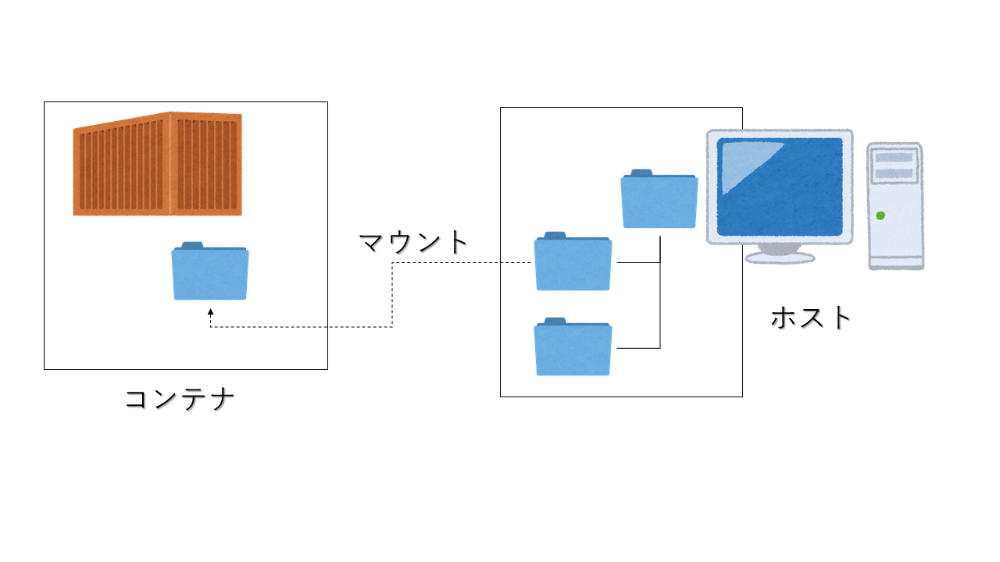
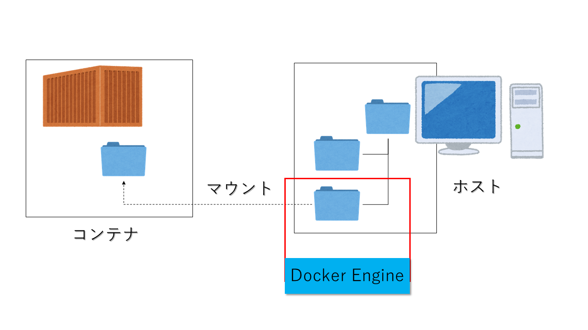

# Dockerのボリュームとネットワークハンズオン

## 概要

Dockerに入門するにあたり、少しとっつきにくいボリュームとネットワークに関して、実際の操作を交えながら解説する。

## ボリューム

### 概要

別章でも解説したように、基本的にコンテナはホストOSや他のコンテナなどとは分離しており、コンテナ内部のデータ等も独立している。  
そのため、コンテナを削除した場合、コンテナ内部のデータは全て削除し、復元することが出来ない。  
そのため本節ではDockerの機能を用いてデータをコンテナやホストOSと共有するする手法について解説する。  

### 種類

Dockerの機能として、ディレクトリやファイルの共有などは以下の3種類で行う。

- bind mount
- volume
- tmpfs mount

この中で特に利用頻度の高い``bind mount``および``volume``と解説と簡単なハンズオンを記述する。  
なお、``tmpfs mount``に関しては簡単な概要のみ紹介する。  

更に応用編として、以下の二つの手法を紹介をする。  

- 複数のコンテナによるvolumeの提供
- データ専用コンテナ

### bind mount

bind mountは以下の図に示すように、ホストOS上の任意のディレクトリを指定して、コンテナにマウントすることができる仕組みである。  
後述のvolumeと異なり、Dockerホストが管理しているディレクトリ配下でなくてよいことが特徴である。  
ただし、ホストOSのファイルシステムに依存してしまう。  
また、コンテナ上のマウントポイント配下に既にファイルが存在した場合、マウントするとコンテナ側のディレクトリが上書きされてしまうことに注意が必要である。  



参考:https://matsuand.github.io/docs.docker.jp.onthefly/storage/bind-mounts/

#### 使い方

まずはホストOS側の適当の適当な位置にディレクトリ及びファイルを作成する。  
今回は``~/Documents``にtestフォルダと適当な中身を記述したtest.txtを作成した。  

そして以下のコマンドを実行し、マウントされているかを確認する。  

```bash
docker run -it --name <コンテナ名> --mount type=bind,src=<testディレクトリまでのパス>/test,dst=/usr/mount centos /bin/bash
```

上記コマンドでは記述にあるように、typeとしてbind mountを設定し、ホストOS側のディレクトリをsrcに、マウント先をdstに設定する。  
コンテナ起動と同時にコンテナにログインした状態になるため、操作を行うと``/usr/mount``ディレクトリ配下に``test.txt``が存在することが確認でき、マウントが成功していることがわかる。  

```bash
docker container inspect <コンテナ名>
```

上記コマンドを実行すると、以下の情報が出力され指定通りにbind mountされていることがわかる。

```json
 "Mounts": [
            {
                "Type": "bind",
                "Source": "/run/desktop/mnt/host/c/Users/hase1/Documents/test",
                "Destination": "/usr/mount",
                "Mode": "",
                "RW": true,
                "Propagation": "rprivate"
            }
        ],
```

### volume

volumeはbind mountと同様にホストOS上のディレクトリをコンテナにマウントすること自体は変わらないが、そのディレクトリをDocker自体が管理していることが大きく異なる。  
その恩恵として以下のメリットが上げられる。  
 
- バックアップや移行が簡単
- DockerCliやAPIを用いてvolumeを管理可能
- 複数コンテナ間で安全に共有可能になる

Dockerからはvolumeの方が多くの場合適切であるとされている。  

なお、実際にvolumeを作成した場合、wsl2の場合は``\\wsl$\docker-desktop-data\version-pack-data\community\docker\volumes``に対象のディレクトリが作成される。



参考:https://matsuand.github.io/docs.docker.jp.onthefly/storage/volumes/

#### -vと--mountの違い

bind mountでは、マウント設定を行う方式として``-v``オプション及び``--mount``オプションの両方で指定することができる。  
ただし、双方の指定方法は少し挙動やオプションの指定方法が異なることに注意が必要である。  
大きな違いを以下にあげる。

- -vオプションを使った場合、マウント先のファイル、もしくはディレクトリが存在しなかった場合、マウントエンドポイントを自動的に作成する。ただしその場合は常にディレクトリとして作成される

- -mountオプションの場合はエンドポイントを自動的に生成せずにエラーになる

また、オプションの指定方式が違う

- vオプションでは``:``区切りでオプションを指定し、順序が異なると正確に認識してくれない

- mountオプションでは``key=value``区切りで指定でき、またオプションの指定順序が適当でもDocker側で解析してくれる

#### 使い方

bind mountでも同様に、実際にvolumeを利用してみる。  
利用方法はbind mountとあまり変わらない。  
以下のコマンドを実行する。  

```bash
docker run -it --name <コンテナ名> --mount type=volume,src=vol001,dst=/usr/volume centos /bin/bash
```

上記コマンドを実行することでvolumeの作成とマウントが行われる。  
bind mountと異なるのは``type=volume``になる点である。  

コンテナ内の``/usr/volume``に移動し、以下のコマンドを実行する。  

```bash
echo "hello" > test001.txt
```

これでvolume配下にテキストファイルが生成される。  
次にコンテナから離脱し、実際にvolumeが作成されているか確認してみる。  
``docker volume ls``を実行すると、以下のようにボリュームが存在することが確認できる。 

```bash
DRIVER              VOLUME NAME
local               vol001
```

また、bind mount同様``docker container inspect <コンテナ名>``を実行すると以下の情報が得られることからもvolumeの作成がわかる。

```json
"Mounts": [
            {
                "Type": "volume",
                "Name": "vol001",
                "Source": "/var/lib/docker/volumes/vol001/_data",
                "Destination": "/usr/volume",
                "Driver": "local",
                "Mode": "z",
                "RW": true,
                "Propagation": ""
            }
        ],
```

ファイルエクスプローラーで``\\wsl$\docker-desktop-data\version-pack-data\community\docker\volumes``を見に行くことでもvolumeの存在が確認でき、先ほど作成したテキストファイルが存在することも確認出来る。

### 読み取り専用

bind mount及びvolumeでは、ホスト側から提供しているディレクトリやファイルに対して、コンテナ側からの権限を指定することが出来る。  
通常、デフォルトでは読み取り及び書き込みが可能であるが、マウント設定時に``readonly``オプションを指定することで、読み取りのみの権限に設定可能である。

### tmpfs mount

tmpfs mountは今までのVolumeやbind mountとはまったく異なり、コンテナの書き込み先はホストマシンのメモリ上で行われる。  
メモリ上のデータは他のコンテナとも共有できず、コンテナの停止とともに削除され、他の方式とは異なり保持し続ける事は出来ない。  
そのため、重要な情報を含んだファイルを一時的に保存するために利用される場合が多い。

### 複数のコンテナによるvolumeの提供

volumeを用いた場合、前述の通り複数のコンテナで簡単にvolumeを共有することができる。  
実際に共有してみる。  

#### 使い方

前述したvolumeの節で作成したvolumeを別のコンテナで共有してみる。  
実行方法は簡単で、以下のコマンドを実行する。  

```bash
docker run -it --name <コンテナ名> --volumes-from <volumeを作成したコンテナ名> centos /bin/bash
```

``--volumes-from コンテナ名``が重要であり、コンテナ名を指定すると、指定したコンテナと同じvolumeが同じディレクトリにマウントされ、共有される。  

なお、volumeを任意の場所にマウントしたい場合は以下のようにすればよい。

```bash
docker run -it --name <コンテナ名> --mount type=volume,src=<ボリューム名>,dst=/usr/test centos /bin/bash
```

### データ専用コンテナ

データの共有化の手法の一つとして、あるコンテナを作成し、そのコンテナを全体の共有データ専用コンテナとして取り扱うことがある。  
このデータ専用コンテナのメリットとしては、コンテナ内でデータの圧縮、展開処理などを行い、データの可搬性やバックアップ、リストアが容易になるというメリットが上げられる。  


## ネットワークの概要

Dockerのコンテナ間の通信を行うにあたり、Dockerでは``link機能``もしくは``コンテナネットワーク``を利用して行うことができる。  
このうち``link機能``はレガシーな機能であり今後削除される可能性があることから、今回は``コンテナネットワーク``に絞って解説を行う。  
また、今回解説するのはあくまで**同一ホスト上で動作するコンテナ間でのネットワーク**であり、複数ホストで起動するコンテナ間のネットワークはまた別途解説する。  

### デフォルトネットワーク

Dockerは、ホストにインストールされた時点で``デフォルトネットワーク``と呼ばれるものを構築する。  
このデフォルトネットワークは3種類存在し、削除不可能である。  
デフォルトネットワークの種類を以下に示す。

|種類|概要|
|:--|:--|
|bridgeネットワーク|デフォルトでコンテナが接続されるネットワーク|
|hostネットワーク|ホスト側のネットワークに接続する|
|noneネットワーク|ネットワークに接続しない|

上記ネットワークは``docker network ls``コマンドを実行することで存在が確認できる。  
なお、後述するユーザー定義ネットワークも作成後は上記コマンドで確認できる。  
デフォルトではコンテナはBridgeネットワークに接続されるが、Dockerのrunコマンド実行時に``--net``オプションで指定する形で任意のネットワークに接続できる。  

以下にそれぞれのネットワークについて説明を行う。

#### bridgeネットワーク

bridgeネットワークは、Linux Bridgeを用いてホスト上に作成した別のネットワークである。  
詳細は省略するが、NAT形式で外部との通信も可能であり、コンテナ間の通信も問題なく行うことができる。  
ただし、接続されたコンテナのIPアドレスはDocker側で任意に割り振られるため、固定のIPアドレスを割り振ることは出来ない。  
そのような設定を行う場合は後述するユーザー定義ネットワークを作成し、そこにコンテナを接続する必要がある。  
また、デフォルトでは名前解決によるコンテナ間の通信を行うことが出来ない。  

bridgeネットワークに実際にコンテナを接続して挙動を確認してみる。  
今回は特にコンテナに機能を要求しないので、busyboxイメージを使用してみる。  
以下のコマンドを実行し、コンテナの立ち上げとコンテナ内のシェルへの接続を行う。  

```bash
docker run -it busybox /bin/sh
```

コンテナへの接続が成功したら``ifconfig``コマンドを実行し、ネットワークを確認してみる。  
以下に示すように、bridgeネットワーク内のIPアドレスが割り振られ、インターネットに接続されていることがわかる。  

```bash
eth0      Link encap:Ethernet  HWaddr 02:42:AC:11:00:02
          inet addr:172.17.0.2  Bcast:172.17.255.255  Mask:255.255.0.0
          UP BROADCAST RUNNING MULTICAST  MTU:1500  Metric:1
          RX packets:11 errors:0 dropped:0 overruns:0 frame:0
          TX packets:0 errors:0 dropped:0 overruns:0 carrier:0
          collisions:0 txqueuelen:0
          RX bytes:906 (906.0 B)  TX bytes:0 (0.0 B)
```

また、コンテナから戻って来て``docker network inspect bridge``コマンドを実行することで、以下のようにbridgeネットワークに先ほどのコンテナが接続されていることがわかる。

```json
"Containers": {
            "3e5621c72f1a8b39d5508dea3879ba644a03c52ef939a71c28a769bfdd069f06": {
                "Name": "eager_goldstine",
                "EndpointID": "3ea456dc77abe9638817e89062624f741276b6b996a1fd27bc8044fc1fd7eb0c",
                "MacAddress": "02:42:ac:11:00:02",
                "IPv4Address": "172.17.0.2/16",
                "IPv6Address": ""
            }
        }
```

もう一つbusyboxコンテナを立ち上げて相互に通信してみましょう。  
再度``docker run -it busybox /bin/sh``で新しいbusyboxコンテナを起動し、接続する。  
先ほどのbusyboxは``172.17.0.2``に存在するので``ping -w3 172.17.0.2``でpingが通ることを確認できる。  
また、先ほどのように``docker network inspect bridge``コマンドを実行することで、以下のようにbridgeネットワークにコンテナが2つ接続されていることがわかる。

```json
       "Containers": {
            "3e5621c72f1a8b39d5508dea3879ba644a03c52ef939a71c28a769bfdd069f06": {
                "Name": "eager_goldstine",
                "EndpointID": "3ea456dc77abe9638817e89062624f741276b6b996a1fd27bc8044fc1fd7eb0c",
                "MacAddress": "02:42:ac:11:00:02",
                "IPv4Address": "172.17.0.2/16",
                "IPv6Address": ""
            },
            "5c3fd2cc67de92cceed3271f3353bc4dfc070bf6ffdd4fec4c729d378a06038d": {
                "Name": "priceless_galois",
                "EndpointID": "d1d1b4bf639e1ad631e3236ebebcf4c7a914ec3a2f8c3f1795d3bf8c641b4439",
                "MacAddress": "02:42:ac:11:00:03",
                "IPv4Address": "172.17.0.3/16",
                "IPv6Address": ""
            }
        }
```

#### hostネットワーク

hostネットワークは、bridgeネットワークとは異なり、ホストマシンと同一のネットワークに接続され、同じネットワークインターフェース、IPアドレスを持つ。  
今回も同様にbusyboxコンテナを作成し、hostネットワークに接続してみる。  

bridgeネットワークとは異なり、前述したように``--net``コマンドでhostネットワークに接続することを設定する為、以下のコマンドを実行する。  

```bash
docker run --net=host -it busybox /bin/sh
```

コンテナに接続した状態で``ifconfig``を実行すると以下のように``eth0``というホストマシンと同様のネットワークインターフェースに接続していることがわかる。

```bash
eth0      Link encap:Ethernet  HWaddr 02:50:00:00:00:01
          inet addr:192.168.65.3  Bcast:192.168.65.15  Mask:255.255.255.240
          inet6 addr: fe80::50:ff:fe00:1/64 Scope:Link
          UP BROADCAST RUNNING MULTICAST  MTU:1500  Metric:1
          RX packets:360627 errors:0 dropped:0 overruns:0 frame:0
          TX packets:114633 errors:0 dropped:0 overruns:0 carrier:0
          collisions:0 txqueuelen:1000
          RX bytes:523407948 (499.1 MiB)  TX bytes:6266052 (5.9 MiB)
```

コンテナから戻り、``docker network inspect host``を実行すると以下のようにhostネットワークにコンテナが接続されていることがわかる。

```json
 "Containers": {
            "1ce98cf510554d4cb78b5567b21f622beb1bda6e6891cda2ccab43b3a3567ad9": {
                "Name": "pedantic_sutherland",
                "EndpointID": "d8fbe5c943400576cdd330df3599f8523ddd743f7e18849c8169579717b083c0",
                "MacAddress": "",
                "IPv4Address": "",
                "IPv6Address": ""
            }
        }
```

#### noneネットワーク

noneネットワークはネットワークドライバが欠如したネットワークであり、通常ここに接続したコンテナはネットワークに接続出来ない状態になる。  
ただ応用的な使用方法として、ユーザ独自のカスタムネットワークドライバと組み合わせてネットワークに接続させることができる。  

今回は普通にnoneネットワークに接続してネットワークに接続出来ないことを確認してみる。

``docker run --net=none -it busybox /bin/sh``

このコンテナも前回と同様に``ifconfig``を実行してみると、以下のようにループバックアドレスしか設定されておらず、ネットワークに接続出来ないことがわかる。

```bash
lo        Link encap:Local Loopback
          inet addr:127.0.0.1  Mask:255.0.0.0
          UP LOOPBACK RUNNING  MTU:65536  Metric:1
          RX packets:0 errors:0 dropped:0 overruns:0 frame:0
          TX packets:0 errors:0 dropped:0 overruns:0 carrier:0
          collisions:0 txqueuelen:1000
          RX bytes:0 (0.0 B)  TX bytes:0 (0.0 B)
```

### ユーザー定義ネットワーク

前述した3つはDockerでデフォルトで用意されているネットワークであるが、ユーザでネットワークを定義できるのが``ユーザー定義ネットワーク``になる。  
このネットワークでは前述したbridgeネットワークのような同一ホスト上の小さなネットワークの定義のみならず、マルチホスト上でネットワークを構成する``overlayネットワーク``やさらにはユーザー自身で定義したネットワークドライバプラグインを実行させることもできる。  
今回は例としてユーザーが定義したbridgeネットワークを定義する。  

まずはネットワークを作成するために以下のコマンドを実行する。  

``docker network create --subnet --subnet 172.18.0.2/16 user_def_network``

続いて``docker network inspect user_def_network``を実行すると、以下のように任意のサブネットが割り当てられたネットワークが作成されていることがわかる。  

```json
[
    {
        "Name": "user_def_network",
        "Id": "0936b8e92211d81075e4a75df879ffd0beb6451a1b33842b1061ec1bfa60c8ce",
        "Created": "2020-10-02T13:40:35.9713893Z",
        "Scope": "local",
        "Driver": "bridge",
        "EnableIPv6": false,
        "IPAM": {
            "Driver": "default",
            "Options": {},
            "Config": [
                {
                    "Subnet": "172.18.0.0/16",
                    "Gateway": "172.18.0.1"
                }
            ]
        },
        "Internal": false,
        "Attachable": false,
        "Ingress": false,
        "ConfigFrom": {
            "Network": ""
        },
        "ConfigOnly": false,
        "Containers": {},
        "Options": {},
        "Labels": {}
    }
]
```

なお、``docker network create``コマンドは種々のオプションが存在し、bridgeネットワークやoverlayネットワークを選択したり、IPv6を有効化することができる。  
 
続いてこのネットワークにまたbusyboxコンテナを接続してみるが、このユーザー定義ネットワークで特徴的なのが各コンテナにサブネット内の固定IPを割り振れることと、コンテナ名およびエイリアスに従ってコンテナ間通信を行う事ができるという点である。  
以下のコマンドを入力し、buxyboxコンテナを作成する。  
``docker run -it --name busybox001 --net user_def_network --ip 172.18.0.10 busybox /bin/sh``

ユーザー定義ネットワークに接続しているため、``--ip``オプションを付与することでコンテナに固定のIPアドレスを割り振る事ができる。  
コンテナ内で今までと同様に``ifconfig``を実行すると以下のように``172.18.0.10``のIPアドレスが割り振られていることがわかる。

```bash
eth0      Link encap:Ethernet  HWaddr 02:42:AC:12:00:0A
          inet addr:172.18.0.10  Bcast:172.18.255.255  Mask:255.255.0.0
          UP BROADCAST RUNNING MULTICAST  MTU:1500  Metric:1
          RX packets:11 errors:0 dropped:0 overruns:0 frame:0
          TX packets:0 errors:0 dropped:0 overruns:0 carrier:0
          collisions:0 txqueuelen:0
          RX bytes:962 (962.0 B)  TX bytes:0 (0.0 B)
```

更に同様に以下のコマンドを実行し、新しいbusyboxコンテナを作成する。  

```bash
docker run -it --name busybox002 --net user_def_network --ip 172.18.0.11 busybox /bin/sh
```

busyboxコンテナ間での通信を行う場合、従来ではipアドレスを指定して行うしかできなかったが、ユーザー定義ネットワークでは内部DNSサーバが自動的に用意されるため、コンテナ名での名前解決を行ってくれる。  
busybox002コンテナ内で以下のコマンドを実行し、名前解決が行われることを確認する。

```bash
ping -w3 busybox001
```

なお、この名前解決はコンテナ名だけでなく、エイリアスなどをユーザー独自に設定することができる。
